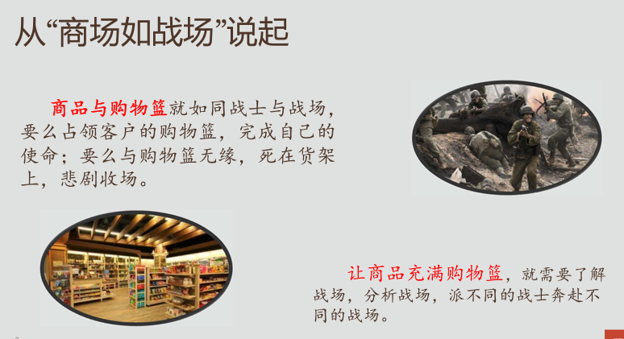

 

---

# 黄联富（®γσ ξηg 雷欧） / 乐发集团（阿里报告）

[**主题曲**](https://github.com/englianhu/report/discussions)

🚄东方快车，🚄一带一路。

<audio controls loop autoplay src="文艺坊歌曲库/東方快車合唱團 Oriental Express - 紅紅青春敲呀敲 《黑松沙士》廣告主題曲.mp3" controls></audio>

**大秦赋** 
春秋战国《*礼记•经解*》 
孔子曰：「君子慎始，差若毫厘，缪以千里。」

> **《礼记•经解》孔子曰：***「君子慎始，差若毫厘，谬以千里。」*[^1]

*引用：[「快懂百科」《礼记•经解》](https://www.baike.com/wikiid/2225522569881832051)和[第一范文网：差之毫厘，谬以千里的故事](https://www.diyifanwen.com/chengyu/liuziyishangchengyugushi/2010051523105152347092749890.htm)和[「百度百科」春秋时期孔子作品《礼记•经解》](https://baike.baidu.com/item/礼记·经解/2523092)和[「當代中國」差之毫釐 謬以千里](https://www.ourchinastory.com/zh/2962/差之毫釐%20謬以千里)*

[^1]: [HTML Color Codes](https://html-color.codes)

## 量化数学中国共识加油赞

### 巫贼巫婆非法回教徒非法民族政权

歼灭那些违反可兰经回教刑事法典断肢法的巫贼巫婆非法回教徒，诈骗巫师回教庞氏骗局回教诸蕃。

> 宁可枝头抱🇹🇼🇨🇳死，  (世袭制十二生肖秦人牧马)
不曾吹落东南风（🇵🇭🇰🇭🇮🇲东楚六郡回教诸蕃：马来西亚、印尼、新加坡、汶莱、辛巴布几内亚、东帝汶巫师巫贼巫婆非法回教徒邪教Cube Ltd博彩庄家）； 
山穷水路疑无🛣， 
柳暗花明又一🌸。

> <s>**®Studio 🇺🇸 GI Joe -vs- Kubuntu 🇲🇳  Kublai Commander**</s> 
<s>**®Studio 🇺🇸 GI Жо -vs- Kubuntu 🇲🇳  Хубилай командлагчч**</s> 
> 菲律宾会稽太阳谷/菲律宾克拉克太阳谷（Clark 中译：书记/会计/秘书/掌柜）文言文（Nguyen完颜氏，世袭制道家 耳元“阮”）越王勾践（世袭制道家，奠耳“鄭”或关耳“郑”、耳东“陈”、耳元“阮”）西征之道～

*出处：[「猫城」通过数码海洋（Digital Ocean）建立服务器](https://github.com/scibrokes/setup-centOS7-DO)*

> 原本浏览比较了很多博彩网，发现1xbet.com（还🈶API）功能最全面最好 ，原本打算科研后，它日去欧洲发展，不过金融市场好（内地也🈶很多合法著名金融投资基金，它日到大陆发展好），决定不赌。
> 
> 金融市场商品外汇牵涉全球经济，被操控的概率低，外汇商品等金融市场统计建模比较容易获得连接金融市场API实时数据的平台也比较多和容易...

*出处：[「统计之都」咨询：如何连接到 Web Browser 网页应用的API](https://d.cosx.org/d/421872-web-browser-api/6)*

  

### 经济西征之路

<iframe width="560" height="315" src="https://www.youtube.com/embed/XI4hl9F6wrE" title="YouTube video player" frameborder="0" allow="accelerometer; autoplay; clipboard-write; encrypted-media; gyroscope; picture-in-picture" allowfullscreen></iframe>

<iframe width="560" height="315" src="//player.bilibili.com/player.html?aid=981862346&bvid=BV1Vt4y1s7B3&cid=725422877&page=1" scrolling="no" border="0" frameborder="no" framespacing="0" allowfullscreen="true"></iframe>

> <s>Нэг бүс нэг зам: Баруун эдийн засгийн экспедицийн зам~</s> 
> 一带一路：经济西征（考察）之路～

*出处：[「威客」一带一路：经济西征（考察）之路～](https://vk.com/englianhu?w=wall611842020_104)* 
和*[「汤普勒」一带一路：经济西征（考察）之路～](https://englianhu.tumblr.com/post/684806031267725312/为什么游戏开发商很少开发中国历史上的其他时期-知乎)*

 

## 乐发集团（东方集团）

- 东方集团

  - 乐发集团
    - 阿里
    - 一号彩
    
### 阿里报告

- 阿里报告
- 彩种报告
- 会员报表

### 闪霓应用

一键生成报告。

 

## 中国手机号

- [中国号，心头好](https://rpubs.com/englianhu/845478)（[备用网址](https://beta.rstudioconnect.com/connect/#/apps/7dd0a6c7-defc-4c82-9c99-8788bb95d7b0/access)）

 

## 参考文献

- [Radiant - A shiny app for statistics and machine learning](https://shiny.rstudio.com/gallery/radiant.html) 🔥
- [Radiant – Business analytics using R and Shiny](https://radiant-rstats.github.io/docs/install.html)
- [Research & Development Business Game](https://shiny.rstudio.com/gallery/rd-business-game.html)
- [New Zealand Trade Intelligence Dashboard](https://shiny.rstudio.com/gallery/nz-trade-dash.html)
- [ScotPHO Profiles Tool](https://shiny.rstudio.com/gallery/scotpho-profiles.html)
- [FIFA'19 Analysis by Nationality](https://demo.appsilon.com/apps/fifa19/#!/country)
- [Material Design + AdminLTE](https://ducthanhnguyen.github.io/MaterialAdminLTE/index3.html) 🔥
- [Improved Skins](https://rinterface.github.io/shinydashboardPlus/articles/more-skins.html)
- [Making a Shiny dashboard using `highcharter` – Analyzing Inflation Rates](https://datascienceplus.com/making-a-shiny-dashboard-using-highcharter-analyzing-inflation-rates)
- [DATA ANALYSIS](https://rpubs.com/Author_Nasila18/836843)
- [永洪一站式大数据分析平台](https://www.yonghongtech.com) ([Demo体验](http://public.yonghongtech.com/bi/?au_act=login&adminv=demo&passv=Yonghong123), [企业试用版](https://www.yonghongtech.com/al/zhuce/index.html?module=shiyong&column=))
- [DATA ANALYSIS](https://rpubs.com/Author_Nasila18/836843)
- [R语言中文网“apriori” 相关内容](https://www.r-china.net/search.php?mod=forum&searchid=23&orderby=lastpost&ascdesc=desc&searchsubmit=yes&kw=apriori)
- [用朴素贝叶斯模型预测柯南中被害人和凶手！](https://gist.github.com/baymaxium/0357d4e9b1d365475659f7f55f851150)
- [如何用简单易懂的例子解释隐马尔可夫模型？](https://www.zhihu.com/question/20962240)
- [R语言估计时变VAR模型时间序列的实证研究分析案例](http://tecdat.cn/r语言估计时变var模型时间序列的实证研究分析案例)

  

---

[ Sςιβrοκεrs Trαdιηg®](http://www.scibrokes.com) 
**[ 世博量化®](http://www.scibrokes.com)企业知识产权®及版权®所有，盗版必究。**
